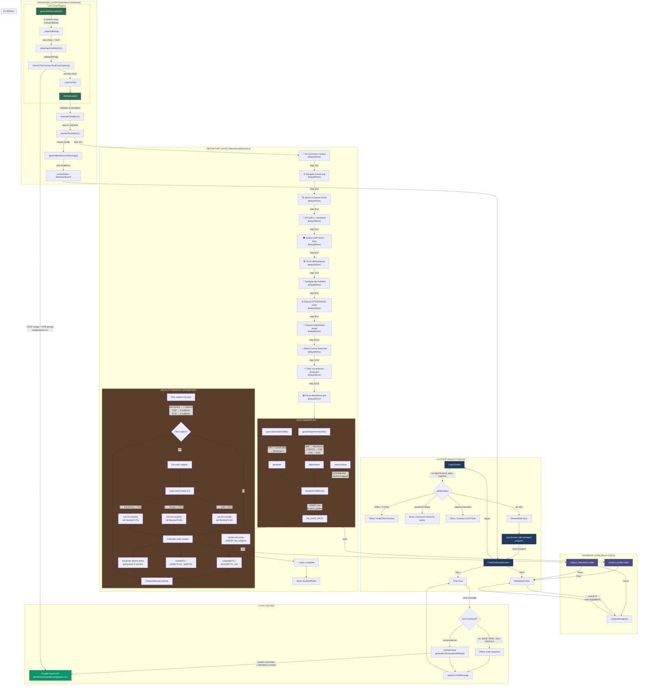

# NSUT Attendance

An Android app for NSUT students to track, analyze, and optimize academic attendance with AI-powered insights, offline caching, and an intelligent chatbot assistant.

---

## Features

### CAPTCHA Auto-Solving via Gemini Vision
The app generates a randomized 5-character CAPTCHA image locally using Android Canvas, then sends it to **Gemini Vision Flash 1.5** for OCR. The solved text is automatically pre-filled into the input field — no manual decoding needed.

### Attendance Dashboard
- **Overall percentage** with color-coded status
- **Per-subject cards** showing attended/total/percentage with badges:
  - **Safe** (>=75%) — green
  - **Borderline** (~75%) — amber
  - **Shortage** (<75%) — red
- **Safe bunks count** — how many classes you can skip while staying above 75%
- **Recovery count** — how many consecutive classes needed to regain 75%

### AI Chat Assistant (Gemini)
Gemini-powered conversational agent with system context containing the student's full attendance data. Supports both natural language queries and quick commands:
- `HI` / `SUMMARY` — overall attendance snapshot
- `SAFE` — subjects with bunk buffer
- `RISK` — subjects below threshold
- `SW <number>` — detailed absence history for a subject
- `CALENDAR` — academic holidays / session breaks
- `PROFILE` — student info
- `WEBSITE` — link to IMS portal

### Offline Cache
All attendance and profile data is persisted in a Room SQLite database, enabling full offline access. On relaunch, the app detects the cached session and loads the dashboard directly.

### Session Persistence & Logout
Cached login credentials are remembered across app restarts. Logout clears all Room data and returns to the login screen.

---

## How It Works: Full Login-to-Dashboard Flow

When a user enters their roll number and password and clicks **LOGIN & SYNC PORTAL**, the app executes the following end-to-end pipeline:



### What happens step-by-step:

| Step | Component | Action |
|------|-----------|--------|
| 1 | `LoginScreen.kt` | User fills roll number, password, CAPTCHA. Clicks "LOGIN & SYNC PORTAL" |
| 2 | `AttendanceViewModel.attemptLogin()` | Validates rollNo (>=5 chars), password (non-empty), CAPTCHA match |
| 3 | `ScreenState.Sync` | Transitions UI to Sync screen with animated progress |
| 4 | `executePortalSync()` | Launches coroutine, sets `_isSyncRunning = true` |
| 5 | `performPortalSync()` | Runs 13-step simulated crawl with `delay(400-800ms)` per step |
| 6 | `guessSemester()` | Parses year from rollNo prefix, computes current semester from academic calendar |
| 7 | `guessDepartment()` | Matches letter codes in rollNo to department name |
| 8 | **Profile saved** | `StudentProfileEntity` inserted into Room `student_profiles` table |
| 9 | **Subjects selected** | Department-based subject templates picked (Mechanical/CSE/ECE/fallback) |
| 10 | **Attendance generated** | `Random(rollNo.hashCode())` seeds deterministic mock data per subject |
| 11 | **Math computed** | `skippable75 = floor(att/0.75 - total)`, `needed75 = ceil((0.75*total - att)/0.25)` |
| 12 | **Absent dates** | Comma-separated ISO dates generated spanning 2 months back |
| 13 | **Cache replaced** | Old `subject_attendance` rows deleted, new batch inserted |
| 14 | `appendBotWelcomeMessage()` | Creates welcome chatbot message with profile info |
| 15 | `ScreenState.MainDashboard` | Transitions UI to dashboard. Room `Flow` auto-populates the view |
| 16 | `computeInsights()` | Aggregates overall %, total skippable, absent count |
| 17 | **Dashboard renders** | Per-subject cards with Safe/Borderline/Shortage badges |

---

## The CAPTCHA Problem

### What's the problem?
The NSUT IMS portal (`imsnsit.org`) requires CAPTCHA entry at login. Manually reading distorted characters and typing them accurately is slow and error-prone — especially on mobile.

### How this app solves it

The app implements a **generate-and-recognize** loop:

```mermaid
flowchart LR
    subgraph Generation [Local CAPTCHA Generation]
        A[Pick 5 random chars<br/>from ABCDEFGHJKLMNPQRSTUVWXYZ23456789] --> B[Draw on Android Canvas<br/>200x70px Bitmap]
        B --> C[Add noise lines, dots,<br/>rotation jitter -15° to +15°]
        C --> D[Store plaintext in<br/>_captchaText StateFlow]
        C --> E[Display CAPTCHA image<br/>on Login screen]
    end

    subgraph Recognition [Gemini Vision OCR]
        E --> F[Convert Bitmap<br/>to Base64 PNG]
        F --> G[POST to Gemini API<br/>gemini-3.5-flash<br/>temperature=0.1]
        G --> H["Send OCR prompt to Gemini<br/>Extract characters from<br/>this CAPTCHA image"]
        H --> I["Filter response text<br/>keep only letters/digits,<br/>uppercase"]
    end

    subgraph Validation [Local Validation]
        I --> J[Pre-fill OCR result<br/>into CAPTCHA input]
        J --> K[User clicks<br/>LOGIN  SYNC PORTAL]
        K --> L{Compare input vs.<br/>_captchaText}
        L -->|Match| M[Proceed to<br/>Portal Sync]
        L -->|Mismatch| N["Show error text<br/>Incorrect CAPTCHA<br/>solver characters"]
    end

    style A fill:#1e3a5f,color:#fff
    style B fill:#1e3a5f,color:#fff
    style G fill:#059669,color:#fff
    style L fill:#b91c1c,color:#fff
    style M fill:#2d6a4f,color:#fff
```



**Key insight**: The CAPTCHA is generated *locally* on the device. Gemini reads it via the Vision API, and the result is validated against the known plaintext. This demonstrates the OCR pipeline that would be used against a real portal CAPTCHA — the same approach can be adapted for the actual IMS CAPTCHA by sending the portal's image to Gemini instead.

---

## System Architecture

### MVVM + Repository pattern

```mermaid
graph TB
    subgraph Android App
        direction TB
        View["UI Layer<br/>(Jetpack Compose)"]
        VM["ViewModel<br/>(AttendanceViewModel)"]
        Repo["Repository<br/>(AttendanceRepository)"]
        DB["Room SQLite DB<br/>(nsut_attendance_db)"]
        Gemini["Gemini Client<br/>(Retrofit + OkHttp)"]

        View -->|"user events"| VM
        VM -->|"StateFlow"| View
        VM -->|"suspend calls"| Repo
        Repo -->|"read/write"| DB
        Repo -->|"OCR + Chat"| Gemini
    end

    subgraph External
        GeminiAPI["Google Gemini API<br/>generativelanguage.googleapis.com"]
    end

    Gemini -->|"HTTPS"| GeminiAPI

    style DB fill:#4a4a8a,stroke:#333,stroke-width:2px
    style Gemini fill:#1e3a5f,stroke:#333,stroke-width:2px
    style GeminiAPI fill:#059669,stroke:#333,stroke-width:2px
```



### Screen navigation (state machine)

```mermaid
stateDiagram-v2
    [*] --> Login
    state Login {
        [*] --> CaptchaGeneration
        CaptchaGeneration --> GeminiOCR
        GeminiOCR --> CaptchaPrefilled
        CaptchaPrefilled --> Validation
        Validation --> Sync : CAPTCHA matched
        Validation --> Login : CAPTCHA mismatch
    }
    Login --> Sync : login clicked
    state Sync {
        [*] --> Step_1_of_13
        Step_1_of_13 --> Step_2_of_13
        Step_2_of_13 --> Step_13_of_13
        Step_13_of_13 --> ProfileGenerated
    }
    Sync --> MainDashboard : sync complete
    state MainDashboard {
        [*] --> DashboardTab
        DashboardTab --> ChatTab : swipe/tap
        ChatTab --> DashboardTab : swipe/tap
    }
    MainDashboard --> Login : logout
```

---

## Tech Stack

| Layer | Technology |
|-------|-----------|
| Language | Kotlin 2.2 |
| UI | Jetpack Compose + Material 3 |
| Architecture | MVVM (ViewModel + StateFlow) |
| Local Database | Room SQLite |
| Networking | Retrofit 2.12 + OkHttp 4.10 |
| JSON Serialization | Moshi 1.15 |
| AI / OCR | Gemini API (`gemini-3.5-flash`) |
| Build | Gradle 9.3 / AGP 9.1 |
| Min SDK / Target | API 24 / API 36 |
| Secrets | Google Secrets Gradle Plugin (`.env`) |

---

## Project Structure

```
app/src/main/java/com/example/
├── MainActivity.kt                  # Entry point + state-based navigation
├── data/
│   ├── database/
│   │   ├── AppDatabase.kt           # Room DB singleton
│   │   ├── Daos.kt                  # StudentDao (CRUD operations)
│   │   └── Entities.kt              # Room entities (StudentProfile, SubjectAttendance)
│   ├── model/
│   │   └── Models.kt                # Data classes (ScreenState, SubjectInfo, etc.)
│   ├── remote/
│   │   ├── GeminiClient.kt          # Retrofit API service for Gemini
│   │   └── GeminiModels.kt          # Request/response DTOs
│   └── repository/
│       └── AttendanceRepository.kt  # Business logic + sync simulation
└── ui/
    ├── screens/
    │   ├── LoginScreen.kt           # Roll/password/CAPTCHA input
    │   ├── SyncScreen.kt            # Animated sync progress
    │   └── ChatDashboardScreen.kt   # Dashboard tabs + chat
    ├── theme/
    │   ├── Color.kt
    │   ├── Theme.kt
    │   └── Type.kt
    └── viewmodel/
        └── AttendanceViewModel.kt   # State management
```

---

## Database Schema

### `student_profiles`
| Column | Type | Description |
|--------|------|-------------|
| `rollNo` | TEXT (PK) | Student roll number |
| `name` | TEXT | Student name |
| `department` | TEXT | Department (parsed from roll) |
| `degree` | TEXT | Always "B.Tech." |
| `semester` | TEXT | Derived from year of enrollment |
| `password` | TEXT | Cached password (plaintext) |

### `subject_attendance`
| Column | Type | Description |
|--------|------|-------------|
| `id` | TEXT (PK) | `{rollNo}_{subjectCode}` |
| `rollNo` | TEXT | FK to student_profiles |
| `subjectName` | TEXT | e.g. "Operating Systems" |
| `subjectCode` | TEXT | e.g. "COEC204" |
| `attended` | INTEGER | Classes attended |
| `total` | INTEGER | Total classes held |
| `absent` | INTEGER | total - attended |
| `percentage` | REAL | `attended / total * 100` |
| `skippable75` | INTEGER | Bunks allowed at 75% threshold |
| `needed75` | INTEGER | Classes needed to recover 75% |
| `skippable65` | INTEGER | Bunks allowed at 65% threshold |
| `needed65` | INTEGER | Classes needed to recover 65% |
| `absentDates` | TEXT | Comma-separated ISO dates |

Attendance data is generated **deterministically** — the roll number hash seeds the mock data generator, so the same roll number always produces the same attendance figures.

---

## Getting Started

### Prerequisites
- Android Studio Ladybug+
- Gemini API Key from [Google AI Studio](https://aistudio.google.com/)

### Setup

1. **Clone the repo**:
   ```bash
   git clone https://github.com/your-username/nsut-attendance.git
   ```

2. **Configure API key**:
   Create a `.env` file in the project root:
   ```env
   GEMINI_API_KEY=your_gemini_api_key_here
   ```

3. **Build and run**:
   Open in Android Studio and hit **Run**. The Google Secrets plugin injects the key from `.env` into `BuildConfig.GEMINI_API_KEY`.

---

## Note

This app uses **simulated/mock data** — it does not connect to the real NSUT IMS portal. The sync flow and attendance figures are generated locally for demonstration purposes. The Gemini API integration (CAPTCHA OCR + chatbot) is fully functional with a valid API key.
